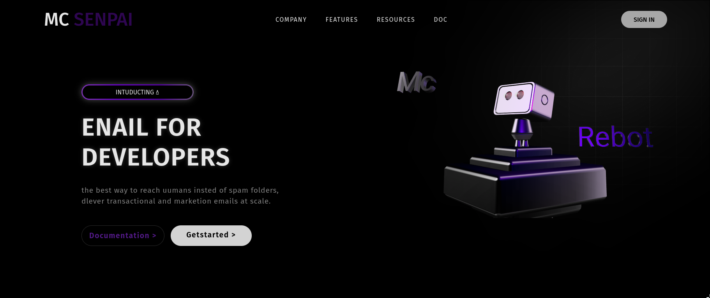

# 🤖 McRobot - Developer Email Landing Page

## 🚀 Live Demo
👉 https://senpai7adim.github.io/McRobot/

---

## 📖 Project Description

**McRobot** is a modern landing page designed for a developer-focused email marketing platform.  
The page features a futuristic UI with:

- Hero marketing section
- Navigation menu
- Call-to-action buttons
- 3D robot visualization using Spline Viewer
- Modern gradient and glass-style effects

---

## ✨ Features

✅ Responsive hero landing layout  
✅ 3D interactive robot model  
✅ Modern UI design  
✅ Smooth marketing presentation structure  
✅ Navigation + CTA buttons  

---

## 🛠 Technologies Used

- HTML5
- CSS3
- Spline 3D Viewer
- JavaScript (ES Modules)

---

## 📸 Preview

